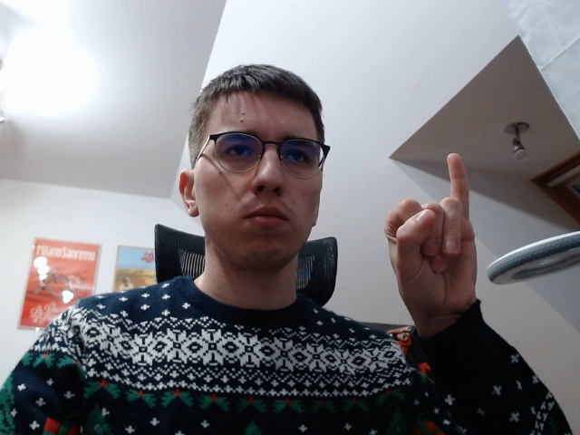
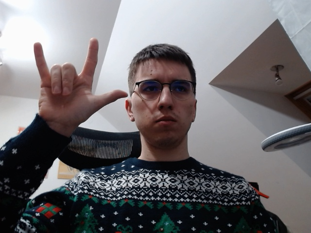
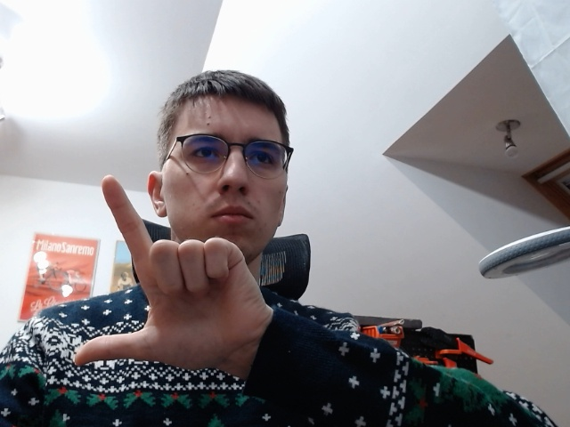
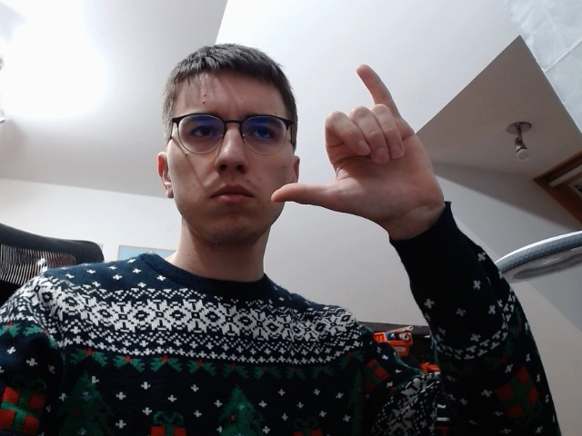

# Sign Language Translation

<a href='https://youtu.be/QVvYU9a_5uQ'>YouTube Prezetacja</a>

## Opis 

Głównym celem projektu jest zbudowanie bazy dla aktywnego translatora języka migowego. Aplikacja zbudowana zostanie przy pomocy Azure Custom Vision i pozwoli na rozpoznawanie różnych gestów z alfabetu oraz z umownego języka migowego.

## Rozpoznawane gesty

Warto zaznaczyć, że porozumiewanie się w sposób alfabetyczny jest wysoce nieefektywne, z tego powodu powstał język umowny, który funkcjonuje wśród głuchniemych. Jezyk taki pozwala na znacznie szybsze przekazywanie informacji niż język alfabetyczny. 

Aplikacja ma być jedynie demem możliwości które w później można dalej rozwijać przez douczanie słownika nowych gestów. Na początku translator będzie rozpoznawał jedynie gesty 'I', 'L', 'Y' oraz złożony gest 'Kocham cię'. Pochodzenie złożonego gestu przedstawione jest na ilustracji poniżej.

# Aplikacja

## Baza danych uczących

Cała baza danych uczacych znajduje się w folderze ./src/images. Wewnątrz tego zbioru dane są podzielone na dwa podzbiory, zbiór treningowy oraz testowy. Podział jest zupełnie sztuczny i dane treningowe będa użyte tylko do ręcznego sprawdzenia działania detektora, ponieważ moduł Custom Vision sam wydziela dane uczące i testujące z całego zbioru.

Zdjęcia były wykonane przy pomocy standardowej kamery komputerowej oraz programu *img_catcher.py* który pozwala na wygenerowanie zdjęć z indywidualnym kodem uuid, dzięki czemu łatwo można uruchomić program do zbierania zdjęć na dowolnym komputerze i potem zebrać zdjęcia zebrane w różnych miejscach w jedną duża bazę, bez obaw o powtarzanie się nazw plików.

Przykłady użytych do treningu zdjęć zdjęć:

 

 

## Maszyna Azure

Moduł umożliwia dwa rodzaje douczania modelu i publikowania nauczonej sieci. Pierwszy jest to wykonanie całości w kodzie przy użyciu SDK w dowolnym środowisku programistycznym. <a href='https://docs.microsoft.com/pl-pl/azure/cognitive-services/custom-vision-service/quickstarts/object-detection?tabs=visual-studio&pivots=programming-language-python'>Dokumentacja SDK</a>

Drugi natomiast umożliwia pracę przy pomocy prostego interfejsu webowego. Dzięki sieci Web można wykonać wszystkie kroki ręcznie, użytkownik zostanie przeprowadzony przez cały proces bez problemu i krok po kroku. <a href='https://docs.microsoft.com/pl-pl/azure/cognitive-services/custom-vision-service/get-started-build-detector'>Dokumentacja Web</a>

Z uwagi na niewielką ilość danych uczących oraz fakt, że korzystałem z tego rozwiązania pierwszy raz, postanowiłem wykorzystać ten drugi sposób.

## Stworzenie Resource

Po uruchomieniu odpowiedniej grupy zasobów, należało na swoim koncie Azure uruchomić zasób odpowiedzialny na Custom Vision module. W tym pomógł bardzo gotowy interfejs na stronie <a href="www.customvision.ai">CustomVision</a>. Oczywiście model płatniczy który wybrałem to S0 - darmowy.

Po uruchomieniu odpowiedniego zasobu należało stworzyć nowy projekt w ramach którego będą wykonywane wszystkie kolejne kroki.

## Przygotowanie zdjęć i tagów

Zaimportowanie wszystkich zdjęć trwało chwilę, po czym pojawiły się wszystkie kategorii untagged. Pierwszym krokiem było utworzenie czterech nowych tagów 'I', 'L', 'Y' oraz 'ILY', tagi te reprezentują wszystkie symbole z języka migowego które na ten moment będziemy rozpoznawać. 

Następnie należało przejść przez wszystkie zdjęcia i odpowiednio zaznaczyć boundingboxy w których znajdują się symbole.

Otagowane zdjęcia przenoszone są do kategorii tagged. Niestety wybrany zbiór danych nie jest symetryczny dwie kategorie są wyraźnie mniej liczne niż dwie pozostałe, co w normalnych warunkach mogłoby źle wpłynąć na jakość klasyfikacji i detekcji. Jednak po tym jakie cudowne działanie tego modułu widziałem na pokazach Microsoftu mam nadzieję, że taka różnica nie wpłynie negatywnie na wyniki. Jeśli wpłynie, zostanie opisana i poprawiona w ewentualnym rozdziale dotyczącym douczania.

## Uczenie

Zastosowano metodę uczenia 'Quick Trainning' dane są bardzo różnorodne i nie powinno być potrzeby na ręczne określanie parametrów uczenia. Wydaje mi się równocześnie, że może to być bardzo dobry test jakości automatycznych algorytmów uczenia dostarczanych przez Microsoft.

Wyniki uczenia - metryki udostępniane po procesie trenningu.

Pomimo dość dobrych wyników uczenia, które zajęło około 10-15 min, po przeprowadzeniu kilku prostych testów okazało się, że niestety ale detektor obiektów nie radzi sobie tak dobrze, jak moglibyśmy tego oczekiwać. Znacznie lepiej radzi sobie ze znakami 'L' i 'Y', ale niestety dość kiepsko z pozostałymi. Po zmianie parametrów obliczeń metryk na wyższe wyraźnie widać, że detektor nie dopasował się wystarczająco do danych. 

Przykładowe wyniki.

## Douczanie sieci

Pierwsza iteracja nie przebiegła pomyślnie, dlatego zastosuję zalecenia ze strony <a href='https://docs.microsoft.com/pl-pl/azure/cognitive-services/custom-vision-service/getting-started-improving-your-classifier'>Zalecenia</a>. 

Zastosowane metody poprawy jakości danych:

1. Zwiększenie liczby zdjęć i wyrównanie ich ilości.
   - Zmienne tło
   - Zmienne oświetlenie 
   - Zmienny rozmiar
   - Zmienny kąt kamery 
   - Zmienny styl - wykonam zdjęcia w rękawiczkach o dwóch różnych kolorach
2. Użycie obrazów ujemnych - takich na których w ogóle nie ma obiektu który ma zostać wykryty

Po zaimplementowaniu powyższych metod wyniki znacznie się poprawiły.

**Niestety** model w iteracji 3 nie rozpoznawał dobrze bardzo dużych znaków, dlatego douczono go jeszcze dla takich symboli gdzie ręka była tuż przed obiektywem kamery i zajmowała większość ramki. Proces ten nie będzie już pokazywany na zdjęciach.

Model iteracji 4 rozpoznał wszystkie elementy bezbłędnie.

## Użycie aplikacji

W pierwotnej wersji wersji translator miał działać w czasie rzeczywistym, jednak nie chciałem przypadkowo zużyć całego dostępnego, w darmowej wersji, dla requestów zasobu zapytań w razie gdybym musiał jeszcze raz w tym miesiącu użyć tego konkretnego modułu. 

Posługując się <a href='https://docs.microsoft.com/pl-pl/azure/cognitive-services/custom-vision-service/use-prediction-api'>Samouczek API</a> oraz <a href='https://southcentralus.dev.cognitive.microsoft.com/docs/services/Custom_Vision_Prediction_3.1/operations/5eb37d24548b571998fde5fa'>Dokumentacja API</a> zbudowałem program pythonowy który po wciśnięciu klawisza 'q' pobiera aktualne zdjęcie i wysyła je do analizy przez odpowiedni Request API. Program wykonujący tłumaczenie to *img_evaluator.py* jeśli taka aplikacja miałaby zaimplementowana w rzeczywistości wystarczyłoby wysyłać zapytania okresowo.

Aby znaleźć parametry do połączenia wystarczy opublikować model i w zakładce **Prediction URL** znajdują się wszystkie informacje.

## Wyniki 

 

